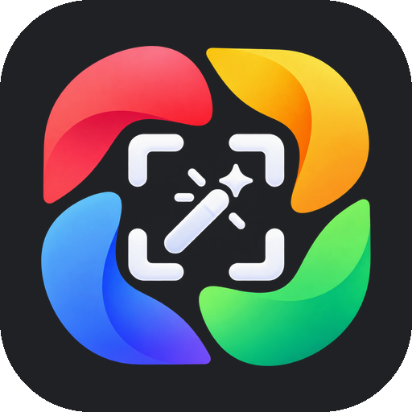

  

<h1 align="center">Editor for Immich</h1>

<b>Your photos. Your edits. Your server.</b>

An open-source Android photo editor and gallery for [Immich](https://immich.app) — or for the
photos on your phone alone, without any server. Everyday editing like in Google Photos,
computed on the device, non-destructive, without Google services, ads or tracking.

> **Unofficial.** This project is not affiliated with, endorsed by, or connected to Immich
> or FUTO. "Immich" is a trademark of FUTO.

> **Early development.** Pre-release builds, tested daily on one phone. Try it with a separate
> Immich user first, not with your real library.

## What it does

- **Edit** in the style of Google Photos: crop, rotate, straighten, and 13 adjustments
  (brightness, contrast, white and black point, highlights, shadows, saturation, warmth, tint,
  blue tones, **Pop**, vignette, sharpness) — calibrated against Google Photos on a test chart
  so that ±100 does roughly what you are used to. Filters, your own presets, "Optimize", pinch
  zoom, long-press for the original.
- **Keep HDR:** Ultra HDR photos stay Ultra HDR. The copy keeps the gain map in the standard
  format, and the preview shows it on HDR screens.
- **Never overwrite:** every edit is saved as a **new copy**. The original stays untouched, the
  copy carries its edit recipe (in XMP), so you can open it again and change the edit later.
- **Gallery:** one timeline over the photos on your phone and on your server, device folders,
  a viewer with stacks, multiple selection (apply a preset or "Optimize" to many photos).

## Where it works

| | |
|---|---|
| **Phone** | Android 14 or newer. No Google Play services needed. |
| **Server** | [Immich](https://immich.app) (major version 3), also [Noodle Gallery](https://github.com/open-noodle/gallery) (an Immich fork with the same API) — or **no server at all**. |
| **Photos** | Photos only on the phone, only on the server, or both. |
| **Languages** | English, German |

**Without a server** the app is a plain editor for the photos on your device: no account, no
login, no network traffic at all (measured). You can connect a server later.

## How it works with Immich

- **Immich stays unchanged.** No server fork, no database changes, no plugin. The app only
  talks to Immich's public API, like the official app does.
- **Edited copies are stacked** in front of the original (Immich's stacks), so the timeline
  shows the edit and the original stays one tap away. Remove the app and you still have ordinary
  photos and stacks.
- **Photos on the phone are edited on the phone**, and the copy goes into the device gallery —
  the Immich app backs it up as usual, and this app stacks it once it has arrived. Photos that
  only live on the server are loaded from there and uploaded again as a copy.
- **HDR-ready:** copies are standard Ultra HDR JPEGs. Any viewer that shows Ultra HDR shows them
  in HDR — including Immich, once it renders HDR.

## How this app is built — yes, it is vibe-coded

The code is written by an AI coding agent (Claude Code), directed by one person who uses it
every day. We say so openly, because it matters when you decide whether to trust an app with
your photos.

It is **not a one-shot generated app.** It grows in small milestones, each with an acceptance
criterion that has to be *measured*, not assumed:

- Changes are tried in an emulator and on the maintainer's own phone (a Pixel), and bugs from
  real use get fixed with a finding and a cause — for example, how the app behaved after an
  Android update.
- Every decision and measurement is written down with how it was measured:
  [docs/DECISIONS.md](docs/DECISIONS.md) (German). The slider calibration against Google Photos,
  for instance, compares 132 color patches per slider.
- Tests: Dart unit tests, JVM tests for the native parts and GPU tests of the renderer.
- A security review went over login, storage, the native bridge and foreign files.

You are welcome to read the code, the tests and the log — and to tell us where we are wrong.

## Why not a pull request to Immich?

A fair question, and it came up with other Immich forks too. Three reasons:

1. **Immich does not want LLM-generated pull requests.** Its
   [contributing guide](https://github.com/immich-app/immich/blob/main/CONTRIBUTING.md) says so
   plainly. We respect that — so this is a separate app that uses Immich's public API, not a fork
   and not a PR.
2. **Immich is building its own editor, carefully.** After four earlier attempts
   ([#3271](https://github.com/immich-app/immich/pull/3271),
   [#5151](https://github.com/immich-app/immich/pull/5151),
   [#9575](https://github.com/immich-app/immich/pull/9575),
   [#11658](https://github.com/immich-app/immich/pull/11658)), Immich v2.5.0 shipped
   non-destructive crop, rotate and mirror, with filters planned
   ([Building the Immich editor](https://immich.app/blog/immich-editor)). This app does not
   compete with that; it fills the gap until then, on Android.
3. **Our renderer is Android-only.** The editing runs on the GPU in native Android code
   (AGSL). Immich serves Android, iOS and the web — a PR would have to cover all three.

Still, the app is kept **as close to Immich as we can**: the same framework as Immich's mobile
app (Flutter), Immich's look, only its public API, and a small, documented edit recipe
([spec](specs/0001-editor.md), *Aufbau*). If the Immich team ever wants to take ideas, the
recipe format or parts of the code, they are welcome to — AGPL-3.0, like Immich itself.

## iPhone?

Flutter builds for iOS too, and most of the app (gallery, editor UI, Immich client) would run
there. The renderer and the HDR handling, however, are native Android code and would need an
iOS counterpart (Core Image or Metal). We have no Apple devices to build and test on — if you
do and want to help, open an issue.

## Ideas, issues, contributions

This project is open to ideas and wishes. Some on our list: a **pro mode** in the spirit of
Lightroom mobile (curves, HSL, masks) — open source, on the device —, perspective correction,
more of Google Photos' tools (Tone, Skin tone, Dynamic, Portrait light), and sharing presets.
The current plan: [docs/ROADMAP.md](docs/ROADMAP.md).

- **Found a bug or have a wish?** Open an issue — screenshots and your phone model help.
- **Want to build something?** Open an issue first so we can agree on the approach.

## Install

Pre-release APKs are on the [Releases](https://github.com/Construxz/immich-editor/releases)
page (`arm64-v8a` for current phones, `universal` if unsure). Check the download against
`SHA256SUMS.txt`.

## Development

Required (versions in use: [docs/STATUS.md](docs/STATUS.md)):

- **Flutter SDK**, stable channel (includes Dart)
- **JDK** in the version `flutter doctor` asks for
- **Android SDK**: command-line tools, platform-tools, one platform, build-tools —
  Android Studio is optional, but the easiest way to install the SDK and an emulator
- **VS Code** with the *Flutter* and *Dart* extensions, or any Flutter-capable editor
- a **real device** with USB debugging — a real gallery beats an emulator

Signing keys and `.env` files never go into the repository (see `.gitignore`).

## Documentation

The project docs are in German. Every statement lives in exactly one file; the others link to it.

| File | owns | maintained by |
|---|---|---|
| [docs/STATUS.md](docs/STATUS.md) | what is true **now**: environment, repository, target API | overwriting |
| [docs/DECISIONS.md](docs/DECISIONS.md) | decisions and findings, with reasons and how they were measured | appending on top |
| [docs/ROADMAP.md](docs/ROADMAP.md) | what is **open**: milestones and open decisions, each with acceptance criteria | deleting what is done |
| [docs/LICENSES.md](docs/LICENSES.md) | register of dependencies, models and references with their licenses | adding entries |
| [specs/0001-editor.md](specs/0001-editor.md) | the concept: scope, storage path, gallery, features, structure | one spec per feature |
| [CLAUDE.md](CLAUDE.md) | working rules for coding agents: constraints, workflow, environment | editing when a rule changes |

Check the docs with `python doccheck.py` (standard library only): broken links, dead anchors,
duplicate item numbers, files without an owner entry.

## License

[AGPL-3.0](LICENSE), like Immich itself.
